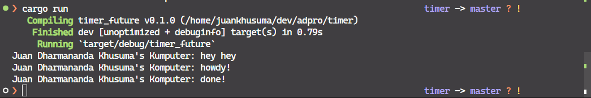
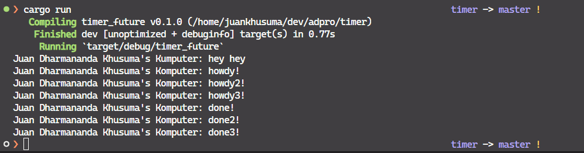
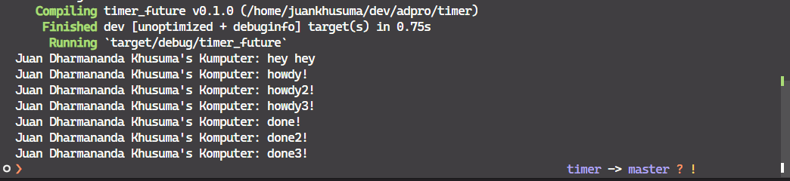
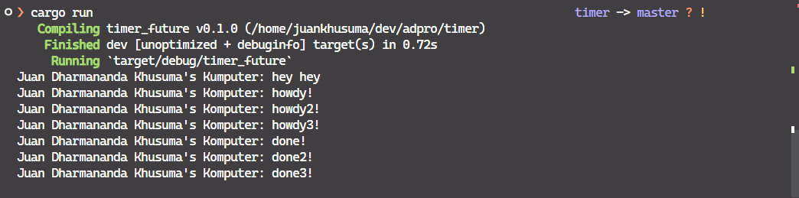

The new message ("hey hey") that is put under the spawner ("howdy!" and "done!") is printed first to the terminal before all of the print statement above it. This is due to the first two print statement is placed on an asynchronous function that is called by the spawner. The spawner is a process that is running in the background and does not halt the main process, so the main function just proceed to the next instruction given, which is printing the last message. That's why the last message is printed first before the first two messages.

As per the previous explanation, the new message ("hey hey") is printed first to the terminal before all of the print statement above it. But after that, all of the "howdy!" messages ("howdy!", "howdy2!, "howdy3!") are first printed sequentially before the "done!" message is printed. This is due to all of the spawner tasks are running asynchronously, so each of the spawner tasks is not waiting for the previous spawner task to finish. That's why all of the "howdy!" messages are printed first before the "done!" message.

With drop, the program prints all of the "howdy!" messages first, then pauses for a moment, then proceeds to print all of the "done!" messages and then the program stops.

Without drop, the program never ends after printing all of the "howdy!" messages. This is due to the drop function is not called, so the executor is still waiting for more task to be assigned to it. The program will only end if the drop function is called, this due to the drop function essentially tells the executor that all of the tasks have been assigned and the executor can stop now.